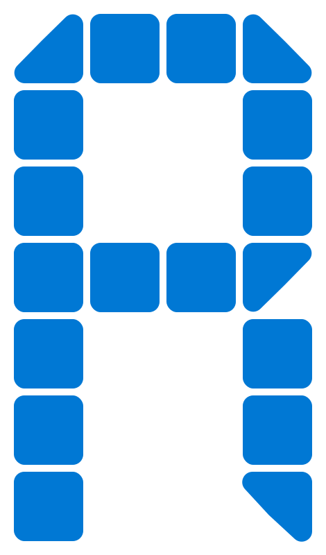

# RealBuddy

A desktop productivity widget that helps you track daily habits with timers, streaks, and a clean, always-on-top interface.



## Features

- **Daily habit tracking** — Define custom habits with icons, names, and time goals
- **Built-in timers** — Track time spent on each habit with start/pause controls
- **Streak system** — Build momentum with visual streak badges (🔥 7+ days, ⚡ 3+ days)
- **30-day history log** — Review your progress over time
- **Always-on-top widget** — Stays visible on your desktop
- **Cross-platform** — Windows, macOS, and Linux

## Screenshots

The widget features a dark theme with customizable accent colors, progress bars, and a mood indicator that reflects your streak status.

## Installation

### From source

1. **Prerequisites:** [Node.js](https://nodejs.org/) (v18 or later)

2. **Clone the repository:**
   ```bash
   git clone https://github.com/Parsa-ahm/RealBuddy.git
   cd RealBuddy/Widgit
   ```

3. **Install dependencies:**
   ```bash
   npm install
   ```

4. **Run the app:**
   ```bash
   npm start
   ```

### Build installers

```bash
cd Widgit
npm run build        # Build for current platform
npm run build:win    # Windows (NSIS + portable)
npm run build:mac    # macOS (DMG + ZIP)
npm run build:linux  # Linux (AppImage + deb)
```

Built installers will be in `Widgit/dist/`.

## Usage

1. **First run** — Add your daily habits (icon, name, hours goal, color)
2. **Each day** — Start timers with ▶, mark tasks done with ✓
3. **Edit** — Tap "edit" to add/remove habits or change settings
4. **Log** — Tap the mood emoji or "log" to view your 30-day history
5. **Reset** — Use "reset" to clear today's progress (with confirmation)

Data is stored locally in your app data folder (`tasks.json`, `logs.json`, `today.json`).

## Tech stack

- [Electron](https://www.electronjs.org/) — Cross-platform desktop app
- [electron-builder](https://www.electron.build/) — Packaging and distribution

## License

MIT
